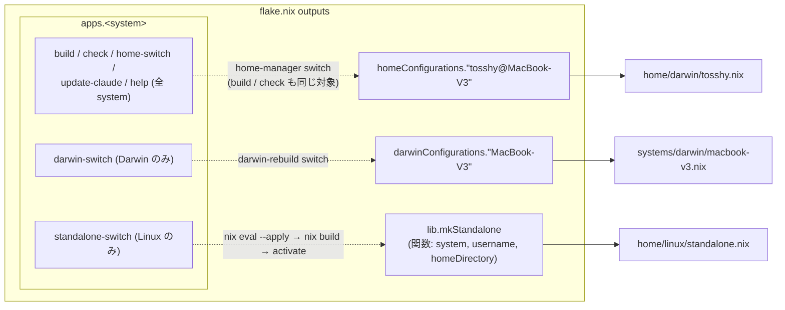
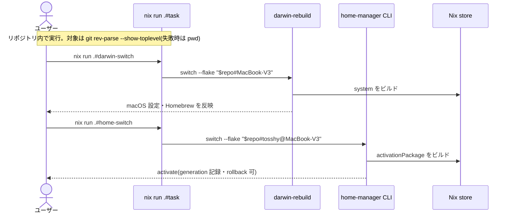
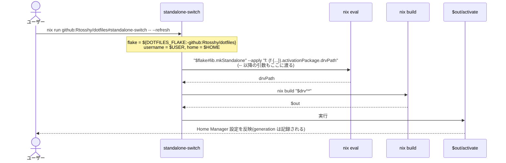

<!-- 出力先: docs/nix/explanation/flake-architecture.md -->

> ✅ **ACTIVE（有効）** — 最終レビュー: 2026-10-06 ／ 次回レビュー期限: 2027-10-06

# dotfiles flake の全体構成(出力・import 関係・適用の流れ)

- [1. flake の出力と入口](#1-flake-の出力と入口)
- [2. モジュールの import 関係](#2-モジュールの-import-関係)
- [3. 適用の流れ](#3-適用の流れ)
- [関連](#関連)

この flake は2種類の環境を扱う。

- **macOS (MacBook-V3)**: システム層(nix-darwin)とユーザー層(Home Manager)を**別々の出力**として持ち、別々に switch する
- **非 NixOS の Linux (standalone)**: ユーザー層だけ。ユーザー名・ホームディレクトリは実行時の環境から受け取る

## 1. flake の出力と入口

| 出力 | 種類 | 組み立てるファイル | 固定されている値 |
|---|---|---|---|
| `darwinConfigurations."MacBook-V3"` | nix-darwin | `systems/darwin/macbook-v3.nix` | ホスト名・ユーザーは `modules/darwin/nix-darwin/*` 側 |
| `homeConfigurations."tosshy@MacBook-V3"` | Home Manager | `home/darwin/tosshy.nix` | `aarch64-darwin`, `tosshy`, `/Users/tosshy` |
| `lib.mkStandalone` | Home Manager を返す**関数** | `home/linux/standalone.nix` | なし(すべて引数) |

ポイント:

- Home Manager は nix-darwin のモジュールとして組み込んでいない。macOS でもシステムとユーザーは独立した出力
- `lib.mkStandalone` が値ではなく関数なのは、`builtins.getEnv` を使わずに `$USER` / `$HOME` を受け取り、flake を pure に保つため(理由の詳細は root の `README.md` の "Why an app instead of `homeConfigurations."standalone"`")
- `build` / `check` / `home-switch` は Linux の apps にも定義されるが、対象は `aarch64-darwin` 用の設定なので Linux では使わない
- `dev/flake.nix` はフォーマッタ・リンタ用の別 flake。`check` タスクと direnv(`.envrc`)から使う

## 2. モジュールの import 関係

```mermaid
flowchart LR
  SYS["systems/darwin/macbook-v3.nix"]
  NH["nix-homebrew.darwinModules<br/>(flake input)"]
  NDS["modules/darwin/nix-darwin/system"]
  NDH["modules/darwin/nix-darwin/homebrew"]
  SYS --> NH
  SYS --> NDS
  SYS --> NDH

  HD["home/darwin/tosshy.nix"]
  HL["home/linux/standalone.nix"]
  SM["modules/shared/ (macOS のみ)<br/>bash / nushell / haskell / emacs<br/>tmux / btop / spotify-player<br/>fonts / wezterm / kitty"]
  OWM["modules/darwin/omniwm"]
  OWMI["omniwm.nix<br/>(flake input)"]
  SB["modules/shared/ (両方)<br/>home-manager (activation 補正)<br/>vim / nvimx / fish / git / rust<br/>direnv / lazygit / starship<br/>claude / codex / herdr"]
  NVX["nvimx.homeModules.nvimx<br/>(flake input)"]

  HD --> SM
  HD --> OWM
  OWM --> OWMI
  HD --> SB
  HL --> SB
  HD --> NVX
  HL --> NVX
```

claude-code は両方の profile がパッケージとして flake input(`sadjow/claude-code-nix`)から入れている。

profile(`home/` 配下)ごとに持っているもの:

| | `home/darwin/tosshy.nix` | `home/linux/standalone.nix` |
|---|---|---|
| shared モジュール | 両方共通の分 + macOS のみの分 | 両方共通の分のみ |
| Darwin 専用モジュール | `modules/darwin/omniwm` | なし |
| profile 内の `programs.*` | home-manager, mise, zoxide | home-manager, zoxide |
| profile 内の独自設定 | ghostty のキーバインド追記 | なし |
| パッケージ一覧 | macOS 向け(macism, pandoc, terraform 等を含む) | Linux 向けの CLI のみ(byobu を含む) |

配置の方針(詳細は `modules/README.md` / `home/README.md`):

- 両方の profile で**同じ設定**になるものは `modules/shared/` に置く(例: direnv)
- 環境ごとに使うかどうかが分かれるパッケージや `programs.*` は `home/` の profile に置く(例: mise, zoxide)
- `modules/darwin/nix-darwin/*` は `systems/darwin/` からしか import しない

## 3. 適用の流れ

### macOS

- 2つは独立しているので、片方だけ switch してよい
- `home-manager` CLI は flake input に固定された版を使う
- 初回は `nix run nix-darwin -- switch ...` と `nix run .#home-switch` で入る(root の `README.md`)

### standalone (Linux)

- flake の既定値が GitHub なのは、Codespace の作業ディレクトリが他人のリポジトリであることが多く、`git rev-parse` だとそれを掴んでしまうため
- `DOTFILES_FLAKE` はこのタスクにだけある上書き用の環境変数。Linux で clone したローカルの設定を、push せずに適用するときに使う(`DOTFILES_FLAKE=. nix run .#standalone-switch`)
- `home-manager` CLI を経由しないので、`rollback` / `generations` / `news` は使えない

## 関連

- `../../../README.md` — インストール手順と、standalone の設計判断(single-user Nix・関数で公開する理由)
- `../../../home/README.md` / `../../../systems/README.md` / `../../../modules/README.md` — 各ディレクトリの役割と配置方針
- `../../../modules/darwin/README.md` — nix-darwin 層と Darwin 専用アプリ層の分け方
- `../../../flake.nix` — 出力と apps の定義本体
